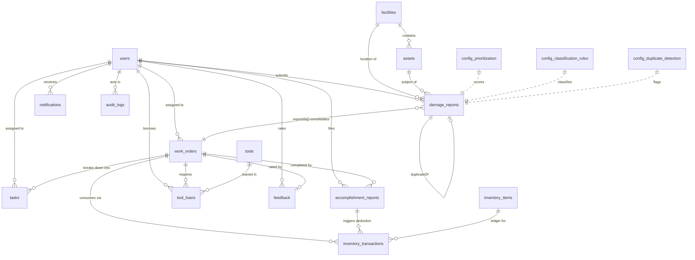

# GSUhub Data Dictionary

Objective **1.B** — the core database structure. Every collection, every
field, its type, whether it is required, and where it comes from.

## How to read the Source column

| Marker | Meaning |
|---|---|
| **§x.y** | Stated in the capstone manuscript at that section. Authoritative. |
| **Fig N** | Read off a UI figure in manuscript §3.5. Strong evidence, but a mockup is not a spec. |
| **DERIVED** | **Not in any source document.** My inference, needed to make the entity work. Review these. |
| **PENDING** | Deliberately unresolved — waiting on a decision from you. |

> ### Why so many DERIVED fields
>
> `GSUhub_Development_Plan.md` §5 — the field-level data model this
> objective was written against — was never available (see
> `architecture_decisions.md` §0). The manuscript specifies some entities
> field by field (`inventory_items` is listed verbatim in §3.4) and others
> only by name. Where the manuscript was silent, I inferred a field set and
> marked it DERIVED rather than inventing a spec and presenting it as
> yours. **Every DERIVED row is a question, not a decision.**

---

## Conventions

- **Document ids** are Firestore-generated except `users`, whose id is the
  Firebase Auth uid, and `config/*`, which use fixed names.
- **Timestamps** are stored as Firestore `Timestamp` and read back as
  **UTC** `DateTime`. Dart's `DateTime` equality compares the UTC flag as
  well as the instant, and response-time reporting across a device's local
  zone would be quietly wrong otherwise.
- **Enums** are persisted as their `name` string (`inProgress`, not `1`).
  An unknown value raises a `ValidationException` naming the field rather
  than defaulting silently.
- **`createdAt` / `updatedAt`** appear on mutable entities; immutable
  records carry a single event timestamp instead.
- **Soft deletes**: `facilities`, `assets` and `users` are deactivated,
  never removed, so historical records keep resolving their denormalized
  copies.

---

## Entity relationships

Two relationships are worth stating explicitly because they are easy to
get backwards:

- **`work_orders.reportIds` is an array, not a foreign key.** Merging
  duplicates consolidates several reports into one work order (§3.4).
  Modelling it as a single `reportId` would make merging impossible
  without deleting reports.
- **`damage_reports.duplicateOf` is self-referential.** A merged report
  keeps its own document and id; it gains a pointer to the parent. Nothing
  is deleted, so the requestor who filed the duplicate can still track it.

---

## users

Firestore id = Firebase Auth uid. Model: `AppUser`
(`features/user_management/data/models/app_user.dart`).

| Field | Type | Required | Description | Source |
|---|---|---|---|---|
| `fullName` | String | ✔ | Display name; must not be blank | Fig 20 |
| `email` | String | ✔ | Institutional email | Fig 20 |
| `role` | enum `UserRole` | ✔ | `requestor` / `maintenancePersonnel` / `admin` | §1.5 |
| `accountStatus` | enum `AccountStatus` | ✔ | `active` / `inactive`; gates all access | §1.5 |
| `department` | String | — | Owning department | **DERIVED** |
| `contactNumber` | String | — | Phone contact | **DERIVED** (Fig 17 shows a CONTACT INFO column, populated with email only) |
| `specialization` | enum `DamageCategory` | — | Personnel trade; drives assignment suggestions | Fig 17 |
| `availability` | enum `PersonnelAvailability` | — | `available` / `busy` / `onLeave` | Fig 17 |
| `activeTaskCount` | int ≥ 0 | ✔ (default 0) | **Denormalized** count of open tasks | Fig 17 |
| `fcmToken` | String | — | Push delivery token | **DERIVED** (implied by §1.5 push requirement) |
| `createdAt`, `updatedAt` | DateTime (UTC) | ✔ | | **DERIVED** |

`accountStatus` and `availability` are deliberately separate: an account
can be active (may sign in) while the person is on leave (must not be
assigned work).

## facilities

Model: `Facility`. **Largely DERIVED** — the manuscript establishes that
facilities are registered and QR-tagged (§1.5, §1.7) and shows a
BUILDING / ROOM pair (Fig 21), but gives no field list.

| Field | Type | Required | Description | Source |
|---|---|---|---|---|
| `name` | String | ✔ | Display name | Fig 21 |
| `buildingName` | String | ✔ | Building | Fig 21 |
| `roomIdentifier` | String | — | Room / sub-area | Fig 21 |
| `locationDescription` | String | — | Wayfinding detail | **DERIVED** |
| `coordinates` | GeoPoint | — | Reference point | **DERIVED** |
| `qrCode` | String | ✔ | Printed QR value; unique | §1.5, §1.7 |
| `isActive` | bool | ✔ | Soft-delete flag | **DERIVED** |
| `createdAt`, `updatedAt` | DateTime (UTC) | ✔ | | **DERIVED** |

> **Uniqueness caveat:** Firestore has no unique-field constraint.
> `qrCode` uniqueness across `facilities` and `assets` must be enforced by
> application logic — the rules cannot do it. Worth a dedicated lookup
> collection in 1.C if collisions matter.

## assets

Model: `Asset`. Equipment fixed at a facility, QR-identifiable, and
something reports are filed *about*. Distinct from `tools` (portable,
borrowed). **Largely DERIVED.**

| Field | Type | Required | Description | Source |
|---|---|---|---|---|
| `name` | String | ✔ | | §1.7 |
| `qrCode` | String | ✔ | Printed QR value | §1.5, §1.7 |
| `facilityId` | String → `facilities` | ✔ | Where it is installed | **DERIVED** |
| `condition` | enum `ItemCondition` | ✔ | excellent / good / fair / poor | Fig 15 |
| `category` | String | — | Free text, not an enum — the manuscript never enumerates asset types | **DERIVED** |
| `serialNumber` | String | — | | **DERIVED** |
| `acquiredAt` | DateTime (UTC) | — | | **DERIVED** |
| `isActive` | bool | ✔ | Soft-delete flag | **DERIVED** |
| `createdAt`, `updatedAt` | DateTime (UTC) | ✔ | | **DERIVED** |

## damage_reports

Model: `DamageReport`. The primary input to the whole lifecycle (§1.7).

| Field | Type | Required | Description | Source |
|---|---|---|---|---|
| `reporterId` | String → `users` | ✔ | | §1.7 |
| `reporterName` | String | ✔ | **Denormalized** from `users.fullName` | Fig 16 |
| `title` | String | ✔ | Short summary | Fig 21 |
| `description` | String | ✔ | Must not be blank | §3.4 Reporting Policy |
| `category` | enum `DamageCategory` | — | Null until classified | §3.4 |
| `classifiedAutomatically` | bool | ✔ (default false) | Keyword match vs. admin classification | **DERIVED** |
| `facilityId` | String → `facilities` | — | | §1.5 |
| `facilityName` | String | — | **Denormalized** from `facilities.name` | Fig 16 |
| `locationDescription` | String | — | Requestor's own location text | §1.5 |
| `assetId` | String → `assets` | — | Set when an asset QR was scanned | §1.5 |
| `coordinates` | GeoPoint | — | Geo-tag; **supplementary only** | §1.5, §2.2 |
| `photoUrls` | List\<String\> | ✔ (default `[]`) | Storage download URLs | §1.5 |
| `requestorPriority` | enum `PriorityLevel` | ✔ | Requestor's own urgency pick | §1.2 |
| `severityRating` | int 1–4 | — | | **PENDING** — see below |
| `safetyRiskRating` | int 1–4 | — | | **PENDING** |
| `frequencyRating` | int 1–4 | — | | **PENDING** |
| `locationImportanceRating` | int 1–4 | — | | **PENDING** |
| `priorityScore` | double 1.00–4.00 | — | Computed weighted score | §3.4 |
| `recommendedPriority` | enum `PriorityLevel` | — | Score mapped via Table 3.5 | §3.4 |
| `officialPriority` | enum `PriorityLevel` | — | **The only authoritative priority** | §1.2 |
| `status` | enum `ReportStatus` | ✔ | | §1.7 |
| `duplicateOf` | String → `damage_reports` | — | Parent after a merge | §3.4 |
| `workOrderId` | String → `work_orders` | — | | §1.7 |
| `reviewedBy` | String → `users` | — | | §1.2 |
| `reviewedAt` | DateTime (UTC) | — | | **DERIVED** |
| `submittedAt`, `updatedAt` | DateTime (UTC) | ✔ | | §1.5 |

### PENDING — who assigns the four criterion ratings?

The manuscript defines the 1–4 scale (Table 3.4) and the formula that
consumes it (§3.4), but **never says who supplies the ratings, or when**.
Three readings are possible and they produce different systems:

1. The **requestor** rates them at submission — but §1.5 says the
   requestor's input is "supplementary information", and asking a
   faculty member to rate Safety Risk contradicts that.
2. The **Administrator** rates them during review — plausible, but then
   the "recommended" priority is derived from the Administrator's own
   judgement and adds little over simply setting the priority directly.
3. The **system** derives them from keywords/history — but §1.5 forbids
   AI/ML and limits the mechanism to predefined rules.

All four fields are therefore **nullable**, and `priorityScore` /
`recommendedPriority` stay null until they are populated.
`DamageReport.effectivePriority` falls back official → recommended →
requestor so the app is usable in the meantime. **Needs your decision
before Objective 4.B.**

## work_orders

Model: `WorkOrder`.

| Field | Type | Required | Description | Source |
|---|---|---|---|---|
| `reportIds` | List\<String\> | ✔ (non-empty) | **Array** — merged duplicates share one work order | §3.4 |
| `title`, `description` | String | ✔ | | §1.7 |
| `category` | enum `DamageCategory` | ✔ | | §3.4 |
| `priority` | enum `PriorityLevel` | ✔ | Copied from the report's official priority | §1.2 |
| `status` | enum `WorkOrderStatus` | ✔ | Kanban column | Fig 19 |
| `assignedPersonnelIds` | List\<String\> | ✔ (default `[]`) | Crew | Fig 18 |
| `facilityId` | String | — | | **DERIVED** |
| `facilityName` | String | — | **Denormalized** | Fig 19 |
| `adminNotes` | String | — | Instruction shown to personnel | Fig 23 |
| `scheduledFor` | DateTime (UTC) | — | | **DERIVED** |
| `startedAt`, `completedAt` | DateTime (UTC) | — | | **DERIVED** |
| `createdBy` | String → `users` | ✔ | The Administrator | **DERIVED** |
| `createdAt`, `updatedAt` | DateTime (UTC) | ✔ | | **DERIVED** |

## tasks

Model: `MaintenanceTask` (named to avoid colliding with `dart:async`
vocabulary). **Largely DERIVED** from Fig 24's checklist.

| Field | Type | Required | Description | Source |
|---|---|---|---|---|
| `workOrderId` | String → `work_orders` | ✔ | | §1.2 |
| `title` | String | ✔ | | Fig 24 |
| `description` | String | — | | Fig 24 |
| `assignedTo` | String → `users` | ✔ | Exactly one owner | Fig 24 |
| `status` | enum `TaskStatus` | ✔ | pending / inProgress / completed | Fig 24 |
| `dueDate` | DateTime (UTC) | — | Drives "Today's To-Do" | Fig 24 |
| `proofPhotoUrls` | List\<String\> | ✔ (default `[]`) | "Upload Proof" | Fig 24 |
| `completedAt` | DateTime (UTC) | — | | **DERIVED** |
| `createdAt`, `updatedAt` | DateTime (UTC) | ✔ | | **DERIVED** |

## accomplishment_reports

Model: `AccomplishmentReport`. Submitting one triggers automatic inventory
deduction (§3.4).

| Field | Type | Required | Description | Source |
|---|---|---|---|---|
| `workOrderId` | String → `work_orders` | ✔ | | §1.5 |
| `submittedBy` | String → `users` | ✔ | | §1.5 |
| `completionNotes` | String | ✔ | Must not be blank | Fig 23 |
| `photoUrls` | List\<String\> | ✔ (default `[]`) | Completed-work photos | §1.5 |
| `materialsUsed` | List\<`MaterialUsage`\> | ✔ (default `[]`) | Embedded; drives deduction | §3.4 |
| `inventoryDeducted` | bool | ✔ (default false) | Idempotency guard | **DERIVED** |
| `reviewedBy`, `reviewedAt` | String / DateTime | — | | **DERIVED** |
| `submittedAt` | DateTime (UTC) | ✔ | | §1.5 |

**`MaterialUsage`** (embedded, not a collection): `inventoryItemId`,
`itemName` (denormalized), `quantityUsed` (> 0, non-integer for litres /
metres), `unitOfMeasurement` (denormalized).

`inventoryDeducted` exists because the manuscript describes the automatic
deduction but not its failure modes. Without a guard, a retried submission
deducts the same stock twice.

## inventory_items

Model: `InventoryItem`. **The one entity the manuscript specifies field by
field** — §3.4 lists the first seven verbatim.

| Field | Type | Required | Description | Source |
|---|---|---|---|---|
| `name` | String | ✔ | | §3.4 |
| `category` | String | ✔ | Free text — stock categories ≠ damage categories | §3.4 |
| `quantityAvailable` | double ≥ 0 | ✔ | **Never written without a matching transaction** | §3.4 |
| `unitOfMeasurement` | String | ✔ | | §3.4 |
| `storageLocation` | String | ✔ | | §3.4 |
| `qrCode` | String | ✔ | QR / barcode | §3.4 |
| `condition` | enum `ItemCondition` | — | §3.4 says "status and condition" | §3.4 |
| `minimumThreshold` | double ≥ 0 | ✔ | Low-stock trigger | §1.5 |
| `createdAt`, `updatedAt` | DateTime (UTC) | ✔ | | **DERIVED** |

## inventory_transactions — append-only

Model: `InventoryTransaction`.

| Field | Type | Required | Description | Source |
|---|---|---|---|---|
| `inventoryItemId` | String → `inventory_items` | ✔ | | §3.4 |
| `itemName` | String | ✔ | **Denormalized** — a ledger must stay readable forever | **DERIVED** |
| `type` | enum `InventoryTransactionType` | ✔ | issuance / consumption / returned / replenishment / adjustment | §3.4 ("issuance, usage, deduction, replenishment"); `adjustment` is **DERIVED** |
| `quantity` | double > 0 | ✔ | Always positive; direction comes from `type` | **DERIVED** |
| `quantityBefore`, `quantityAfter` | double ≥ 0 | ✔ | Balance either side | **DERIVED** |
| `workOrderId` | String | — | | §3.4 |
| `accomplishmentReportId` | String | — | Idempotency key for auto-deduction | **DERIVED** |
| `notes` | String | — | | **DERIVED** |
| `performedBy` | String → `users` | ✔ | | §3.4 |
| `performedAt` | DateTime (UTC) | ✔ | | §3.4 |

**How append-only is enforced** (three layers, because one is not enough):

1. `InventoryTransaction` has **no `copyWith`** — deliberately, and it is
   the only model in the codebase without one.
2. `InventoryRepository` exposes no update/delete for transactions, and no
   way to write `quantityAvailable` directly. The only path is
   `recordTransaction`, which writes ledger entry and balance together.
3. `firestore.rules` allows `create` and denies `update`/`delete` for
   every role, administrators included.

> **Known gap:** security rules cannot verify that a balance write was
> accompanied by a ledger write in the same batch. A client with the
> personnel role could in principle update `quantityAvailable` alone. 1.C
> should close this with a Cloud Function or a transactional rule if the
> guarantee needs to be airtight.

## tools / tool_loans

Models: `Tool`, `ToolLoan`. Durable equipment, separate lifecycle from
consumables.

**tools** — `toolCode` (Fig 15 "TL-0824"), `name`, `status`
(`ToolStatus`), `condition` (`ItemCondition`), `qrCode`, `category`
(DERIVED), `storageLocation` (DERIVED), `currentHolderId` (Fig 15
"Current User"), `currentLoanId` (**denormalized** pointer, DERIVED),
`createdAt`/`updatedAt`.

*Invariant:* a tool with `status == borrowed` must have a
`currentHolderId` — enforced in the constructor. Personnel accountability
(§1.5) is meaningless otherwise.

**tool_loans** — `toolId`, `toolName` (**denormalized**), `borrowedBy`,
`workOrderId`, `borrowedAt`, `expectedReturnAt` (DERIVED), `returnedAt`,
`conditionOnBorrow`, `conditionOnReturn`, `notes`.

*Invariants:* `returnedAt` cannot precede `borrowedAt`; a returned loan
must record `conditionOnReturn`. Recording condition at both ends is what
makes damage attributable to a custodian (§1.5, §3.4).

## feedback

Model: `ServiceFeedback` (named to avoid colliding with Flutter's
`Feedback`).

| Field | Type | Required | Description | Source |
|---|---|---|---|---|
| `workOrderId`, `reportId` | String | ✔ | | §1.5 |
| `submittedBy` | String → `users` | ✔ | | §1.5 |
| `responseTimeRating` | int 1–5 | ✔ | | §1.5, §1.7 |
| `serviceQualityRating` | int 1–5 | ✔ | | §1.5, §1.7 |
| `overallSatisfactionRating` | int 1–5 | ✔ | | §1.5, §1.7 |
| `comments` | String | — | | Fig 23 |
| `submittedAt` | DateTime (UTC) | ✔ | | §1.5 |

**Three independent ratings, never blended.** Averaging them would erase
the distinction between a fast-but-sloppy repair and a slow-but-excellent
one — exactly the signal the GSU needs. Any averaging is a presentation
choice for the analytics view, not a stored field. Scale is 1–5 from the
five-star control in Fig 23.

Per §1.5, ratings "do not automatically determine personnel performance
evaluations" — which is why `firestore.rules` denies personnel read access
to this collection entirely.

## notifications

Model: `AppNotification`. **Document shape is DERIVED** — the manuscript
says when notifications fire (§1.5), not how they are stored.

`recipientId`, `type` (`NotificationType`), `title`, `body`,
`relatedEntityType` (a `FirestorePaths` collection name, for deep links),
`relatedEntityId`, `isRead`, `readAt`, `createdAt`.

*Invariant:* `isRead == true` requires a `readAt`.

## audit_logs — append-only

Model: `AuditLogEntry`. Backs §3.4's Auditability requirement.

`actorId`, `actorName` (**denormalized** — an audit entry must stay
legible after the account is renamed or deactivated, which is exactly when
it is most likely to be read), `action` (`AuditAction`, **DERIVED**
vocabulary), `entityType`, `entityId`, `description`, `changes`
(free-form map), `timestamp`.

No `copyWith`, no update/delete in the repository, `create`-only in the
rules. An audit trail that privileged users can rewrite is not evidence.

## config/*

Three fixed-id documents. Data rather than constants because §1.5 limits
the engine to "predefined keywords, categories, criteria, ratings, and
assigned weights" — a rule engine GSU staff cannot retune without a
rebuild would not survive a real maintenance office.

### config/classification_rules

`keywordsByCategory` (map of `DamageCategory.id` → keyword list, seeded
from Table 3.3), `caseSensitive` (**DERIVED**, default false),
`updatedAt`, `updatedBy`.

### config/prioritization — PENDING

`activeScheme`, `integerWeights`, `decimalWeights`, `thresholds`,
`minRating`, `maxRating`, `updatedAt`, `updatedBy`.

**The manuscript states the weights twice and they disagree:**

| Criterion | Table 3.2 | §3.4 formula |
|---|---|---|
| Severity | 3 | 0.40 |
| Safety Risk | **4** | 0.30 |
| Frequency | 2 | 0.20 |
| Location Importance | 3 | 0.10 |

This is not a notation difference. Table 3.2 ranks **Safety Risk**
highest; the formula ranks **Severity** highest. Normalizing Table 3.2
(0.25 / 0.33 / 0.17 / 0.25) does not reconcile them. Whether a live
electrical hazard outranks a large but harmless defect is a GSU policy
question.

Both schemes are therefore stored side by side, with `activeScheme`
selecting which the scoring engine reads. Nothing is hardcoded, nothing is
silently reconciled, and changing the answer later is a one-field edit
rather than a migration.

Note also that the integer weights sum to 12, not 1.0, so scores computed
from them do not land in the 1.00–4.00 range Table 3.5's bands assume —
they need normalizing first. `activeWeightsAreNormalized` surfaces this.
**Needs your decision before Objective 4.B.**

### config/duplicate_detection

`enabled`, `matchOnFacilityIdentifier`, `matchOnLocation`,
`matchOnCategory` (the first three of §3.4's five criteria),
`descriptionSimilarityThreshold` (**DERIVED** default 0.75),
`timeWindowHours` (**DERIVED** default 72), `updatedAt`, `updatedBy`.

§3.4 lists the five comparison inputs but gives no numeric values; the
two defaults are starting points to tune against real data. Detection only
ever **flags** — §1.5 requires administrator verification before any
merge.

---

## Denormalization register

Every denormalized copy, and what keeps it in sync. Each one is a
deliberate read-performance trade: the alternative is an N+1 lookup per
row in a list view.

| Field | Copied from | Written by | Staleness risk |
|---|---|---|---|
| `damage_reports.reporterName` | `users.fullName` | Report creation | User renamed → stale. Acceptable: the report records who filed it *at the time*. Refresh on rename if it matters. |
| `damage_reports.facilityName` | `facilities.name` | Report creation | Facility renamed → stale. Same reasoning. |
| `work_orders.facilityName` | `facilities.name` | Work-order creation | As above. |
| `users.activeTaskCount` | count of open `tasks` | `TaskRepository.setStatus` and task assignment, via `UserRepository.adjustActiveTaskCount` | **Highest risk.** Must be an atomic increment, never read-modify-write, or concurrent assignments will lose counts. Drift corrupts the Admin personnel view; a periodic reconciliation job is worth considering in 1.C. |
| `accomplishment_reports.materialsUsed[].itemName` / `.unitOfMeasurement` | `inventory_items` | Report submission | Intentionally frozen — a historical record should read as it did when filed. |
| `inventory_transactions.itemName` | `inventory_items.name` | Transaction creation | Intentionally frozen (ledger). |
| `tool_loans.toolName` | `tools.name` | Loan creation | Intentionally frozen (history). |
| `tools.currentLoanId` | open `tool_loans` doc | Borrow / return | Must be cleared on return; a stale pointer offers a Check In action for a loan already closed. |
| `audit_logs.actorName` | `users.fullName` | Entry creation | Intentionally frozen. |

---

## Composite indexes

`firebase/firestore.indexes.json` holds **22** composite indexes, derived
from the query surface the repository interfaces actually define — not
copied from the development plan's list, which was unavailable. The count
therefore differs from the seven that list reportedly contains; treat
these as a superset to reconcile against it.

Coverage by collection: `damage_reports` (5 — reporter history, active
queue excluding duplicates, status+priority, category+status, facility
history), `work_orders` (2 — assignee board, status+priority),
`tasks` (2), `accomplishment_reports` (1), `inventory_items` (1),
`inventory_transactions` (2), `tool_loans` (2), `tools` (1),
`feedback` (1), `notifications` (2), `audit_logs` (2), `users` (1 —
personnel assignment filter).

Firestore creates single-field indexes automatically; only the composites
are listed. **Not deployed** — that is 1.C.

---

## Security rules

`firebase/firestore.rules` and `firebase/storage.rules` are written and
**not deployed**.

The permission matrix is **DERIVED from manuscript §3.4's per-role
Requirements Specification**, since the development plan's §4 matrix was
unavailable. Shape:

| | requestor | personnel | admin |
|---|---|---|---|
| `users` | own record | own record | all |
| `facilities`, `assets` | read | read | full |
| `damage_reports` | create + read own | read assigned, advance status | full |
| `work_orders` | — | read/update **assigned only** | full |
| `tasks` | — | read/update own | full |
| `accomplishment_reports` | — | create own | read all, review |
| `inventory_items` | read | read + balance via transaction | full |
| `inventory_transactions` | — | create only | create only |
| `tools`, `tool_loans` | read tools | borrow/return own | full |
| `feedback` | create + read own | **no access** (§1.5) | read all |
| `notifications` | own only | own only | own only |
| `audit_logs` | — | create only | read + create |
| `config/*` | read | read | full |

Deactivated accounts (`accountStatus != 'active'`) lose all access
regardless of role. Users cannot modify their own `role` or
`accountStatus` — the obvious privilege-escalation path. Storage uploads
are capped at 10 MB and restricted to `image/*` (both **DERIVED**).

**Review this matrix against the real §4 before deploying.**

---

## Open questions summary

| # | Question | Blocks | Where modelled |
|---|---|---|---|
| 1 | Which prioritization weight scheme is authoritative? | Objective 4.B | `config/prioritization` holds both |
| 2 | Who assigns the four 1–4 criterion ratings, and when? | Objective 4.B | Four nullable fields on `damage_reports` |
| 3 | Does the real §4 permission matrix match the derived one? | 1.C deployment | `firestore.rules` |
| 4 | Do the real §5 field lists match the DERIVED entities? | Objectives 2–6 | This document |
